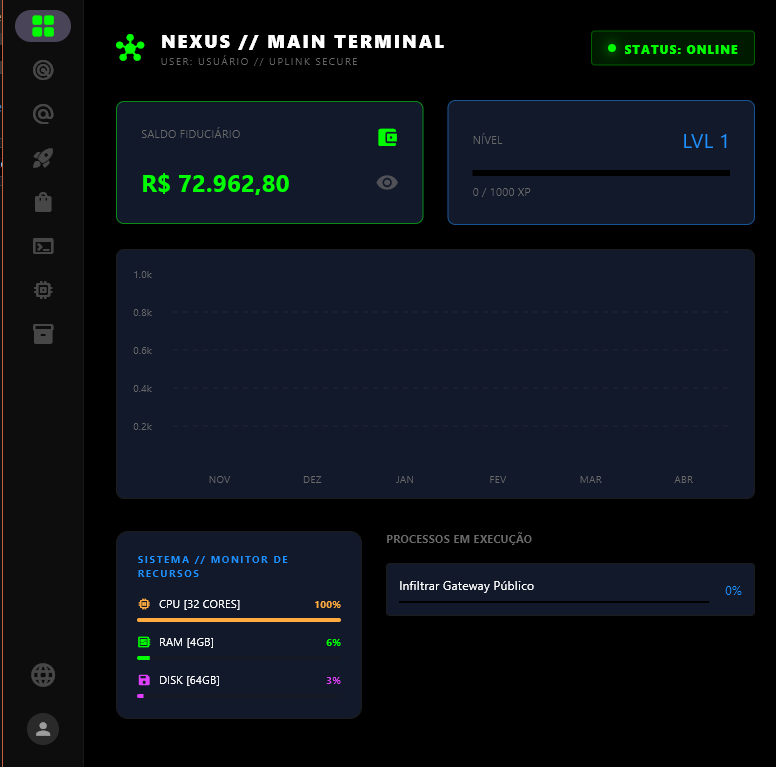
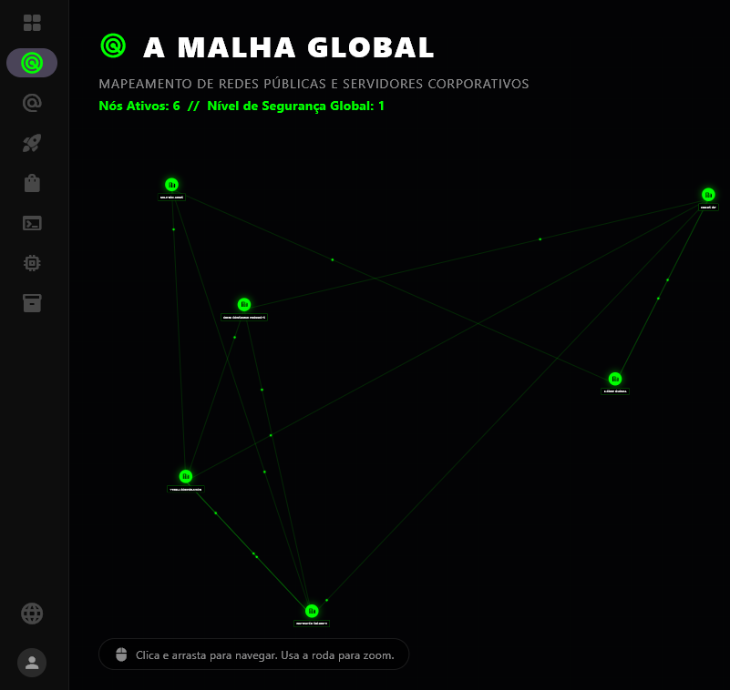
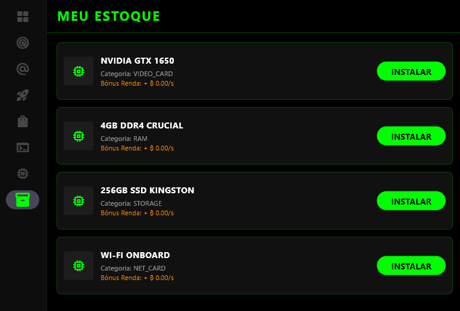
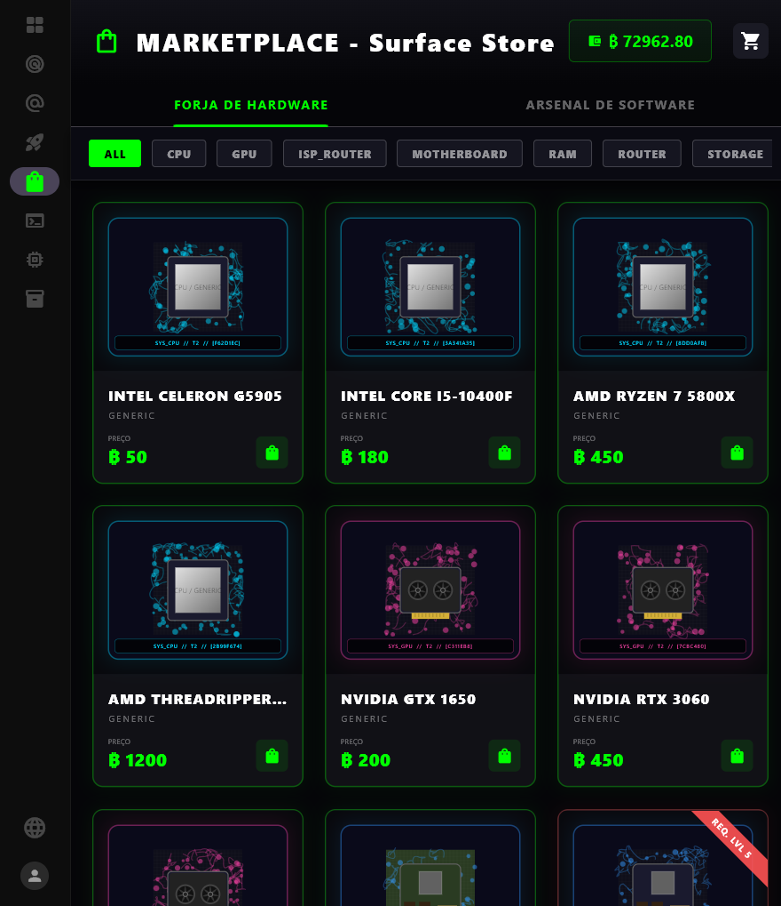
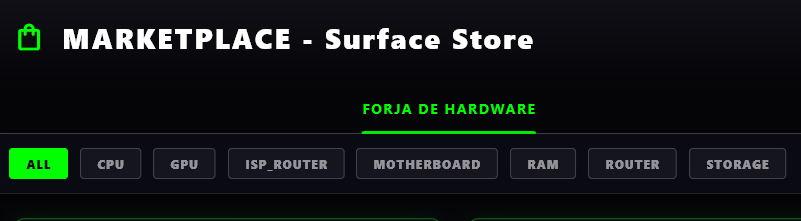
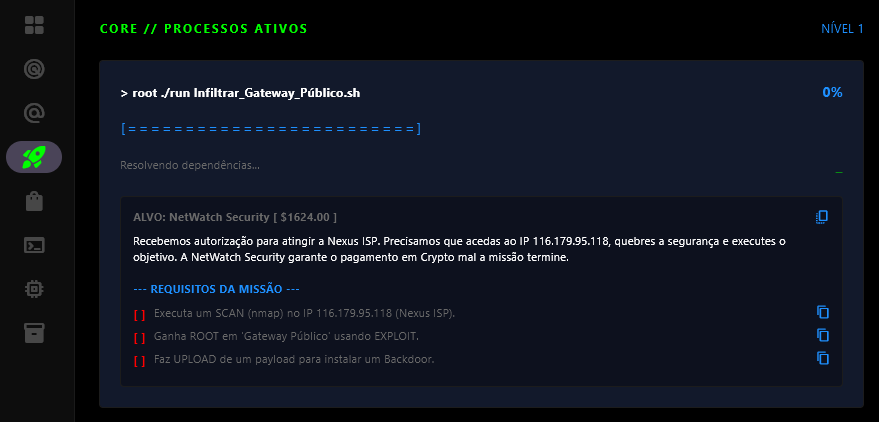
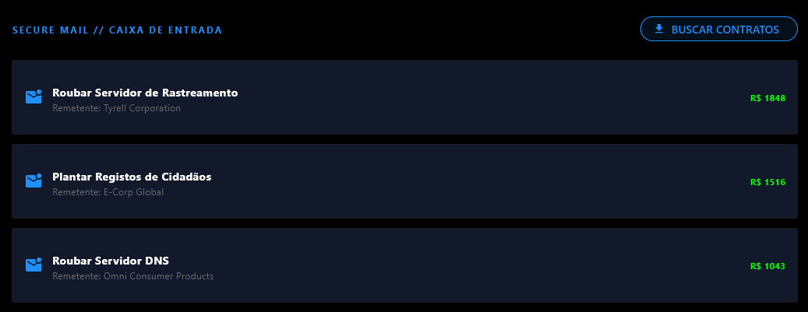

  <picture>
    
  </picture>

 

  

  <em>Um Sistema Operacional de bolso para o submundo cibernético.</em>

 

  
  
  
  
  

---

## 🌐 O Projeto

> *"No submundo digital, a sua máquina é o seu bunker. E o seu terminal, a sua arma."*

O **FreelaVerse** é um simulador de hacking multijogador focado em interface de linha de comandos (CLI). Construído para quem vive no terminal, o jogo funde a mecânica imersiva de exploração de redes (estilo *Hacknet* e *Uplink*) com uma economia passiva de Botnets, Mineração e montagem de Hardware.

A regra é estritamente técnica: faça o reconhecimento (`nmap`), encontre a vulnerabilidade, escale privilégios (`exploit`), roube os dados do contrato, apague os seus logs (`rm -rf`) e desconecte antes que o rastreio ativo atinja 100%.

---

## 📸 Interface Visual (OS UI)

*(Alpha Build Screenshots)*

  <table>
    <tr>
      <td align="center"><b>Dashboard & Analytics</b> </td>
      <td align="center"><b>Topologia Mesh</b> </td>
    </tr>
    <tr>
      <td align="center"><b>Inventário & Setup Local</b> </td>
      <td align="center"><b>Dark Web Market</b> </td>
    </tr>
    <tr>
      <td align="center"><b>Pesquisa & Filtros de Mercado</b> </td>
      <td align="center"><b>Missões & Contratos</b> </td>
    </tr>
    <tr>
      <td align="center" colspan="2"><b>Inbox & Comunicações Criptografadas</b> </td>
    </tr>
  </table>

---

## 💻 Features Letais

O FreelaVerse não é apenas um terminal falso; é um **Ecossistema Virtual Completo (OS)** rodando dentro do seu dispositivo.

| Módulo Core | Especificação Técnica |
| :--- | :--- |
| 📟 **Terminal Tático (CLI)** | Mais de 20 comandos mapeados via `CommandRegistry` (`ifconfig`, `net_map`, `wifi_tool`, `nano`). O tempo de execução de quebra de senhas reage em tempo real aos *specs* de RAM e CPU do seu hardware virtual. |
| 🕸️ **Topologia Mesh** | Não basta atacar. Você precisa pivotar. Use o `NetworkTreeBuilder` para visualizar nós de rede interconectados, pular entre proxies e invadir Servidores Corporativos camada por camada. |
| 🌐 **Navegador NetSurf (Deep Web)** | Uma internet simulada rodando in-game. Acesse o **FreelaSearch**, Fóruns Hackers, **Exchange de Criptomoedas**, Portais Bancários e a Wiki através de um motor de renderização nativo. |
| ⚙️ **Engenharia de Hardware** | A `MySetupView` suporta **Drag & Drop / Hot-Swap** de Placas-Mãe, CPU, GPU, RAM e Storage. O hardware substituído sofre depreciação matemática e volta para o seu inventário. |
| 🎨 **Arte Procedural** | Nada de imagens estáticas na Loja. O motor utiliza `procedural_hardware_art.dart` para desenhar PCBs e chips em tempo de execução, mudando as cores dependendo do clock e da capacidade da peça. |
| 📧 **Contratos & Corporações** | Um sistema de `Inbox` dinâmico. Receba propostas de facções Red Team, aceite contratos corporativos da *Genesis* e gerencie os seus projetos simultâneos. |
| 🤖 **Integração IA** | Motor PVE alimentado pelo `ia_service.dart`, gerando defesas adaptativas em servidores corporativos que tentam rastrear o jogador em tempo real. |

---

## 🏗️ Arquitetura e Engenharia (Sob o Capô)

  <picture>
    
  </picture>

 

O projeto foi desenhado para escalar até milhares de jogadores simultâneos, mantendo o custo de infraestrutura na nuvem próximo de zero.

* 🧠 **State Management (Mixins):** Padrão `Provider` fragmentado via *Mixins*. Separação rigorosa de domínios (Hardware, Rede, Economia, Status) para evitar super-objetos (*God Classes*).
* 🗺️ **Single Source of Truth (SSOT):** Navegação automatizada via `NavigationRegistry`. Interfaces complexas (Side Panels e IndexedStacks) são geradas em tempo de compilação.
* 💽 **Storage Híbrido (Zero-Lag):**
  * **Local-First:** O dispositivo do utilizador dita a verdade temporária para o Dashboard (Gráficos de Produtividade) e Inventário. Zero latência.
  * **Cloud (Firebase):** Autenticação segura e Backups atômicos assíncronos protegidos por padrões de *Debounce*.
* 🔒 **Segurança Anti-Cheat:** Implementação de *MutEx Locks* (Travas de Exclusão Mútua) nas rotinas de checkout do terminal para neutralizar exploits de *Double-Spending*.

---

## 🎮 Acesso Antecipado (Alpha Build)

O projeto é mantido sob desenvolvimento restrito (Closed-Source Core). 

Se você é um desenvolvedor, analista de segurança ou entusiasta de simuladores imersivos e quer testar os limites do nosso terminal, **junte-se à rede**.

> 📩 **Solicite a sua Chave de Acesso:** [Insira seu link de Discord / Twitter / Email aqui]

 

  <em>Transmissão Criptografada. Cuidado com os Daemons.</em>

