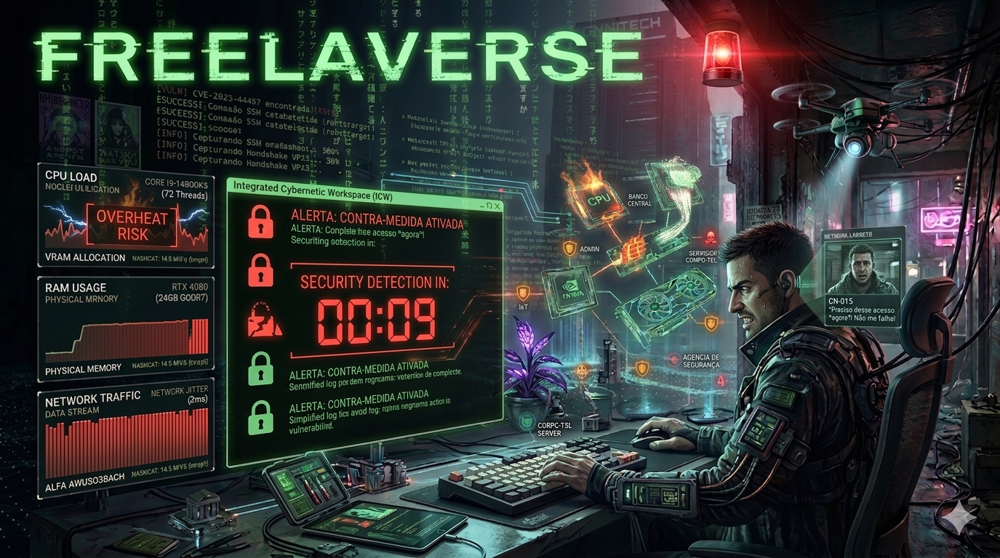
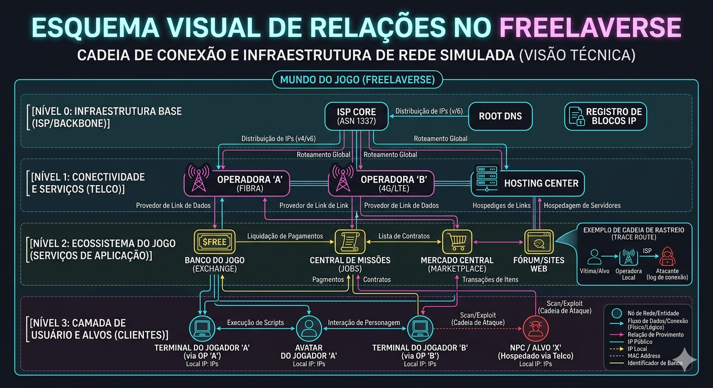

  <picture>
    
  </picture>

 

  

  <em>Um Sistema Operacional de bolso para o submundo cibernético.</em>

 

  
  
  
  
  

---

## 🌐 O Projeto

> *"No submundo digital, a sua máquina é o seu bunker. E o seu terminal, a sua arma."*

O **FreelaVerse** é um simulador de hacking multijogador focado em interface de linha de comandos (CLI). O jogo funde a mecânica imersiva de terminais (estilo *Hacknet* e *Grey Hack*) com uma arquitetura de persistência híbrida e economia passiva (Botnets e Mineração).

A regra é puramente técnica: encontre a vulnerabilidade, escale privilégios, roube os dados para cobrar o *bounty*, apague seus logs e desconecte antes que o rastreio bata 100%.

---

## 💻 Features Letais

O FreelaVerse não é apenas um terminal falso; é um Ecossistema Virtual (OS) completo rodando dentro do seu dispositivo.

| Módulo | Especificação Técnica |
| :--- | :--- |
| 📟 **Terminal Tático (CLI)** | Interface assíncrona operada por um `CommandRegistry` de roteamento dinâmico. Execute `nmap`, `ping`, `exploit` e `wifi_tool`. A velocidade dos comandos reage em tempo real aos *specs* de RAM e CPU do seu hardware virtual. |
| 🌐 **Navegador NetSurf (Deep Web)** | Uma internet simulada completa rodando in-game. Acesse fóruns, Exchange de Criptomoedas, Portais Bancários e a Wiki através de um motor de renderização nativo (`web_page_renderer.dart`). |
| ⚙️ **Hardware Hot-Swap** | Monte seu PC peça por peça. A `MySetupView` suporta "Troca a Quente" de CPU, GPU, RAM e Storage. O hardware substituído sofre depreciação matemática e regressa ao *stash* local para revenda. |
| 🎨 **Arte Procedural (Mercado)** | Os componentes na loja não são imagens estáticas. O motor utiliza `procedural_hardware_art.dart` para desenhar PCBs e chips em tempo de execução com base nos *status* de cada peça. |
| 💸 **Economia Idle/Ativa** | Crie *Daemons* de defesa, minere Créditos (₿) em background com Redes Zumbi, e equilibre os ataques do *Red Team* com as defesas do *Blue Team*. |

---

## 🏗️ Arquitetura e Engenharia (Sob o Capô)

  <picture>
    
  </picture>

 

O projeto foi desenhado para escalar até milhares de jogadores simultâneos, mantendo o custo de infraestrutura na nuvem próximo de zero.

* 🧠 **State Management (Mixins):** Padrão `Provider` fragmentado via *Mixins*. Separação rigorosa de domínios (Hardware, Rede, Economia, Status) para evitar super-objetos (*God Classes*).
* 🗺️ **Single Source of Truth (SSOT):** Navegação via `NavigationRegistry`, gerando UIs complexas (Side Panels e IndexedStacks) em tempo de compilação sem risco de *Index Out of Bounds*.
* 💽 **Storage Híbrido (Zero-Lag):**
  * **Local-First (Hive/SQLite):** O dispositivo do utilizador dita a verdade temporária para inventário. Zero latência de rede.
  * **Cloud (Firebase):** Utilizado estritamente para Autenticação, Matchmaking (WebRTC/P2P) e Backups assíncronos protegidos por padrões *Debounce*.
* 🔒 **Segurança Anti-Cheat:** Implementação de *MutEx Locks* (Travas de Exclusão Mútua) nas rotinas de checkout do terminal para neutralizar exploits de *Double-Spending* e ataques DDoS locais.

---
